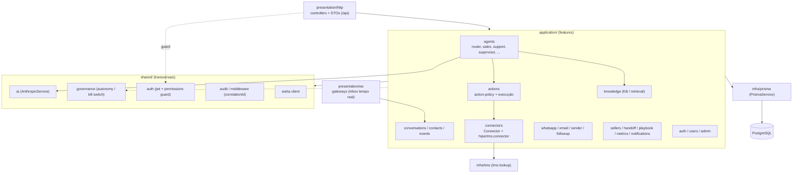

# C4 — Nível 3: Componentes (Backend Nexa)

> Interior do container **Backend API**. Acima: `c4-container.md`.

## Diagrama



## Componentes-chave

### Boundary
- **`presentation/http/<feature>`** — controllers + DTOs sob `/api`; sem regra de
  negócio. Protegidos por `JwtAuthGuard` + `PermissionsGuard` (`@RequirePerm`).
- **`presentation/ws`** — gateways socket.io para o inbox em tempo real.

### Aplicação (features)
- **`agents`** — agentes especializados (router, sales, support, diagnostic,
  resolution, escalation, case-classifier, conversation, supervisor). Ver
  `docs/ai/ai-agents.md`.
- **`actions`** — `action-policy.ts` define quais ações exigem backend/humano; o
  serviço valida antes de executar (a IA só solicita).
- **`connectors`** — `Connector` (interface, ADR 010) + `hipertms.connector`;
  fronteira única com produtos externos.
- **`knowledge`** — KB versionada/aprovada + retrieval (RAG futuro).
- **`conversations` / `contacts` / `events`** — núcleo conversacional + event bus.
- **`opportunities`** — pipeline de vendas (estágios new→qualified→proposal→won/lost).
- **`portal`** — sessão e chamados do cliente (Portal de Suporte; ADR 022/025).
- **Canais**: `whatsapp` (WAHA), `email`, `sender`, `followup`.
- **Operação**: `sellers`, `handoff`, `playbook`, `metrics`, `notifications`.

### Transversais (`shared`)
- **`ai`** — `AnthropicService` (cliente Claude, custo/tokens).
- **`governance`** — `AutonomyService` (kill switch).
- **`auth`** — JWT (cookie HttpOnly) + `PermissionsGuard` + `PlatformAdminGuard`.
- **`tenant`** — `EffectiveTenantInterceptor` (tenant efetivo / acting-as + break-glass).
- **`config`** — `validateEnv` (checagem de segredos no boot).
- **`audit` / `middleware`** — auditoria + `correlationId` por request.
- **`waha`** — cliente WhatsApp.

> No boundary HTTP, além das features há `products` (catálogo via `ConnectorsService`)
> e `health`.

### Infra
- **`infra/prisma`** — `PrismaService` (acesso ao Postgres).
- **`infra/tms`** — `tms-lookup` (leitura do HiperTMS).

## Fluxo típico (mensagem do lead)

```
WAHA → http/ws → Supervisor (valida entrada) → Router (classifica)
     → agente especializado (usa AI + KB) → [solicita ação?]
        → actions (valida policy) → connector → HiperTMS
     → Supervisor (valida saída) → resposta → WAHA
     (tudo com correlationId + tenantId; auditoria registra)
```

## Relacionados

- `docs/architecture/codebase-structure.md` · `docs/ai/ai-agents.md`
- ADR 003 — Agentes · ADR 010 — Conectores · ADR 012 — Segurança da IA
