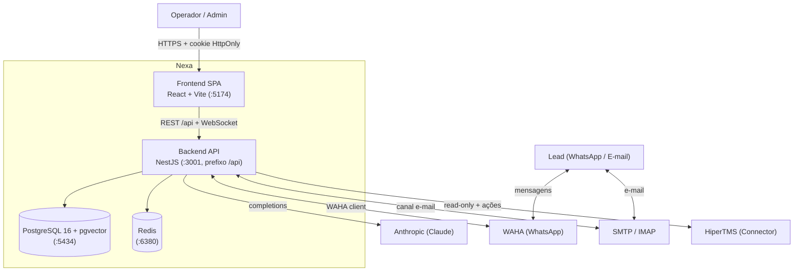

# C4 — Nível 2: Containers (Nexa)

> As peças executáveis do Nexa e como se comunicam. Acima: `c4-context.md`.
> Abaixo: `c4-component.md` (interior do backend).

## Diagrama

## Containers

| Container | Tecnologia | Porta | Responsabilidade |
|---|---|---|---|
| **Frontend SPA** | React 18 + Vite 5 + Tailwind 3 | 5174 | Painel de operação (inbox, campanhas, KB, playbooks); cookie HttpOnly |
| **Backend API** | NestJS + Prisma | 3001 (`/api`) | API REST, WebSocket, agentes de IA, conectores, governança |
| **PostgreSQL** | Postgres 16 + pgvector | 5434 | Dados (contatos, conversas, KB, ações, auditoria); embeddings (RAG futuro) |
| **Redis** | Redis | 6380 | Cache / filas / coordenação |

Serviços externos: **Anthropic** (modelo), **WAHA** (WhatsApp, :3018),
**SMTP/IMAP** (e-mail), **HiperTMS** (via Connector). Portas deslocadas das do
HiperTMS/n8n para coexistirem.

## Comunicação

- Frontend ↔ Backend: REST sob `/api` (axios, cookie HttpOnly) + WebSocket
  (socket.io) para o inbox em tempo real.
- Backend ↔ Anthropic: HTTP completions (`shared/ai/anthropic.service.ts`).
- Backend ↔ WhatsApp: WAHA client (`shared/waha/`).
- Backend ↔ HiperTMS: interface `Connector` (ADR 010), leitura e solicitação de
  ações; nunca acoplado ao produto direto.
- Eventos internos via `EventEmitter` (ADR 004) com `correlationId`/`tenantId`.

## Ambientes

dev / staging / production com bancos e segredos isolados (ADR 013). Ver
`docs/infra/ci-cd.md`.

## Relacionados

- `docs/architecture/c4-component.md` · `docs/architecture/codebase-structure.md`
- `docs/infra/deploy.md` · ADR 004 — Event Bus · ADR 013 — Environment
