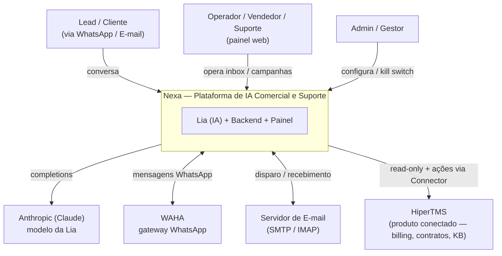

# C4 — Nível 1: Contexto (Nexa)

> Quem usa o Nexa e com quais sistemas ele fala. Para o detalhe interno, ver
> `c4-container.md` e `c4-component.md`.

## Diagrama

## Atores

- **Lead / Cliente** — conversa com a Lia por WhatsApp ou e-mail (vendas, onboarding,
  suporte).
- **Operador / Vendedor / Suporte** — usa o painel (inbox, campanhas, base de
  conhecimento, playbooks) e assume conversas quando a IA escala.
- **Admin / Gestor** — configura permissões, parâmetros e o **kill switch** de
  autonomia da IA.

## Sistemas externos

- **Anthropic (Claude)** — modelo que dá voz à Lia (`AI_MODEL`, default Haiku).
- **WAHA** — gateway de WhatsApp (envio/recebimento).
- **Servidor de e-mail** — canal de leads via e-mail (ADR 021), SMTP/IMAP.
- **HiperTMS** — primeiro produto conectado. O Nexa **não reinventa billing**:
  consome o produto via **Connector** (ADR 008/010), em geral read-only, e
  solicita ações (ex.: cobrança) que o backend executa.

## Princípio de fronteira

A IA conversa; o backend decide e executa; o produto conectado é a fonte de verdade
de billing/contrato. Nenhuma ação externa parte direto do agente (ADR 012).

## Relacionados

- `docs/architecture/c4-container.md` · `docs/overview/system-overview.md`
- ADR 009 — Leads como Plataforma · ADR 010 — Conectores
