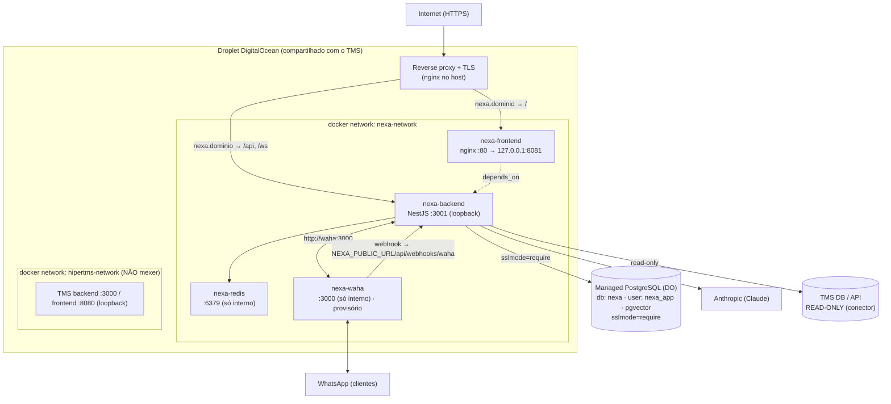

# Implementação — Primeiro Deploy em Produção (DigitalOcean)

> Documento-mestre do **primeiro deploy do Nexa em produção**. Descreve o "como"
> ponta-a-ponta para um dev executar passo a passo. Modela-se pelo deploy maduro do
> **HiperTMS** (repo irmão). **Nada de código aqui** — só a documentação.
>
> Status: spec pronta para revisão · Autor: Aria (Architect) · Data: 2026-06
> Base: ADR 013 (ambientes/deploy), `docs/infra/deploy.md`, `docs/security/*`.

## Companion docs (ler na ordem)

1. **Este doc** — arquitetura, componentes, portas, redes, fluxo de deploy.
2. [`docs/infra/deploy-managed-postgres.md`](../../infra/deploy-managed-postgres.md) — provisionar banco no cluster gerenciado + pgvector.
3. [`docs/infra/deploy-migrations-baseline.md`](../../infra/deploy-migrations-baseline.md) — **BLOQUEADOR CRÍTICO**: baseline de migrations.
4. [`docs/infra/deploy-dockerization.md`](../../infra/deploy-dockerization.md) — Dockerfiles, compose de produção e cache dos modelos de IA.
5. [`docs/infra/deploy-env-production.md`](../../infra/deploy-env-production.md) — `.env.production.example` + tabela de variáveis.
6. [`docs/infra/deploy-runbook.md`](../../infra/deploy-runbook.md) — segurança/operação, runbook de deploy, rollback e remoção.

---

## 1. Contexto e decisão de arquitetura

Primeiro deploy do Nexa (monorepo pnpm: `apps/backend` NestJS+Prisma, `apps/frontend`
React+Vite). **Coexiste com o HiperTMS no mesmo droplet**, sem afetá-lo. Decisões:

- **Banco do Nexa:** no **cluster Postgres gerenciado** existente do DigitalOcean —
  cria-se um database `nexa` + usuário dedicado `nexa_app` (permissões só nesse DB);
  habilita-se a extensão **pgvector**. (Não usar o Postgres em container em produção.)
- **Redis:** container leve no droplet (rede interna do Nexa, sem porta no host).
- **WhatsApp (WAHA):** container `devlikeapro/waha` no droplet (rede interna, sem porta
  no host, volume de sessão). **Provisório** — será trocado pela **API oficial do
  WhatsApp (Cloud API)**; mantido isolado pra facilitar a troca (ver ADR do provider).
- **App:** Docker no **droplet existente do TMS** — backend (`:3001`) + frontend
  (nginx). Portas **só em loopback** (atrás de reverse proxy), `mem_limit` por
  container, rede docker própria **`nexa-network`**, portas **distintas** das do TMS.
- **Padrão espelhado do TMS:** `Dockerfile.production` (build 2 estágios + `pnpm deploy`),
  `Dockerfile` do frontend (nginx), `docker-compose.production.yml`,
  `.env.production.example`, workflow `deploy.yml` (build→DockerHub→SSH→pull/up→healthcheck).

## 2. Diagrama de componentes



> O **reverse proxy do host** roteia o domínio do Nexa: `/` → frontend,
> `/api` e `/ws` → backend. O TMS continua no próprio domínio/porta, intocado.

## 3. Portas e redes

| Serviço | Container | Porta interna | Exposição no host | Observação |
|---|---|---|---|---|
| Backend Nexa | NestJS | 3001 | `127.0.0.1:3001` | atrás do reverse proxy |
| Frontend Nexa | nginx | 80 | `127.0.0.1:8081` | atrás do reverse proxy |
| Redis Nexa | redis 7.2 | 6379 | **sem porta no host** (só `nexa-network`) | leve |
| WAHA Nexa | devlikeapro/waha | 3000 | **sem porta no host** (só `nexa-network`) | provisório; ~512 MB; volume de sessão |
| Managed PG | — | 25060 (DO) | endpoint do cluster (externo) | `sslmode=require` |
| **TMS backend** | — | 3000 | `127.0.0.1:3000` | **não alterar** |
| **TMS frontend** | — | 80 | `127.0.0.1:8080` | **não alterar** |

- Rede docker dedicada **`nexa-network`** (bridge) — isola os containers do Nexa
  dos do TMS (`hipertms-network`).
- Portas do Nexa (`3001`, `8081`) **escolhidas para não colidir** com as do TMS
  (`3000`, `8080`). Confirmar no droplet que `8081` está livre antes do 1º deploy.

## 4. Fluxo de deploy (espelha o TMS)

```
push em main/master
  → CI (lint/test/build/prisma validate)
  → build & push imagens DockerHub: nexa-backend, nexa-frontend (tag = versão + latest)
  → SCP: docker-compose.production.yml + .env.production.example → ~/nexa/ no droplet
  → SSH no droplet:
      docker login → compose pull → compose up -d
      → healthcheck (curl /api/health no :3001 e / no :8081, ~7 tentativas)
      → prune das imagens antigas (mantém as 3 mais novas + as em uso)
  → rollback automático: se o healthcheck falhar, sobe a imagem anterior (ver runbook)
```

Detalhe do workflow, healthcheck e rollback em
[`deploy-runbook.md`](../../infra/deploy-runbook.md).

## 5. Pré-requisitos (ordem de execução)

1. **Banco**: provisionar `nexa`/`nexa_app` + pgvector no cluster — `deploy-managed-postgres.md`.
2. **Migrations baseline** (CRÍTICO): resolver o squash antes de qualquer `migrate
   deploy` em banco novo — `deploy-migrations-baseline.md`.
3. **Imagens**: definir Dockerfiles + compose — `deploy-dockerization.md`.
4. **Env**: preencher `.env` no droplet a partir do `.env.production.example` —
   `deploy-env-production.md`. Lembrar: `validateEnv` **aborta o boot** se faltar
   `DATABASE_URL`, `JWT_SECRET`, `JWT_REFRESH_SECRET`, `ANTHROPIC_API_KEY`,
   `WAHA_WEBHOOK_TOKEN`, `PORTAL_JWT_SECRET`.
5. **Rede/segurança**: reverse proxy + HTTPS do domínio do Nexa, firewall, swap,
   snapshot — `deploy-runbook.md`.
6. **WAHA**: subir o container, **parear a sessão (QR via túnel SSH)** e confirmar o
   registro do webhook no boot — `deploy-runbook.md` §1.5. (Provisório → Cloud API.)

## 6. Regras inegociáveis

- **Nunca** rodar migration no banco do TMS — o conector é **read-only** (ADR 010/015).
  As migrations do Nexa rodam **só** no `DATABASE_URL` do Nexa.
- Produção usa **`prisma migrate deploy`**, nunca `migrate dev` (ADR 013).
- **Não commitar segredos.** Valores reais só no `.env` do droplet (rotação conforme
  `docs/security/secrets-management.md`).
- Mudanças **aditivas e isoladas**; não tocar nos containers/portas/rede do TMS.
- CI verde antes do deploy; snapshot do droplet antes de subir.

## 7. Referências

- ADR 013 — Environment Strategy · `docs/infra/deploy.md` · `docs/infra/ci-cd.md`
- `docs/infra/prisma-migrations.md` · `docs/security/secrets-management.md`
- Modelo: `hipertms_v12` (`apps/api/Dockerfile.production`, `docker-compose.production.yml`,
  `.github/workflows/deploy.yml`).
